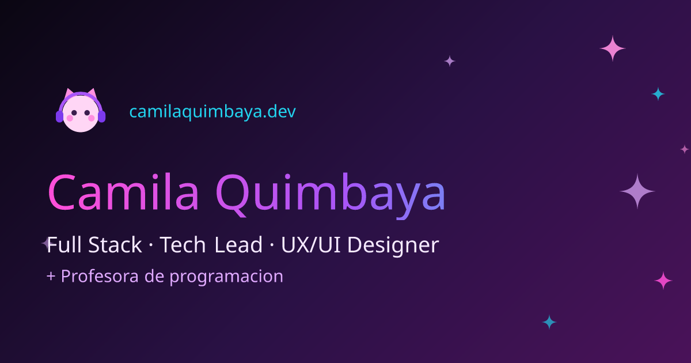

  

 

---

## ✦ Sobre mí

🌸 Desarrolladora **Full Stack** y **Tech Lead**, diseñadora **UX/UI** y **profesora de programación**.

💜 Me obsesiona el punto exacto donde el código limpio se encuentra con un diseño que enamora.

🎀 Estética favorita: **cyberpunk rosa + kawaii** (¿se nota? 👀).

🌍 Latinoamérica · Remoto · siempre aprendiendo algo nuevo.

---

## 🛠️ Tech Stack

**🎨 Frontend**

**⚙️ Backend & Data**

**🚀 DevOps & Tools**

---

## 📊 Mis estadísticas

 

 

---

### ✦ stay kawaii · keep coding ✦

🌸 Mira mi portafolio en vivo → <a href="https://camilaquimbaya.dev">camilaquimbaya.dev</a>

